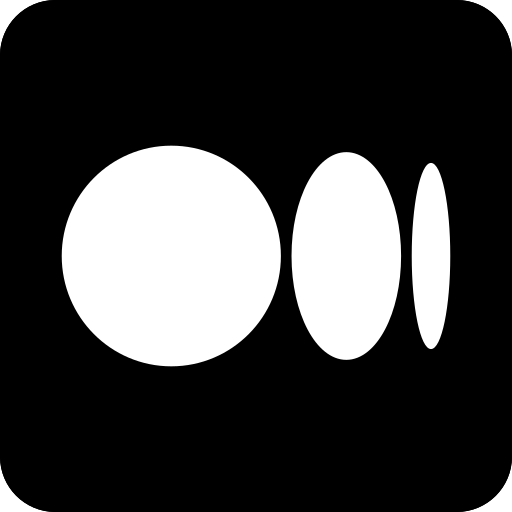
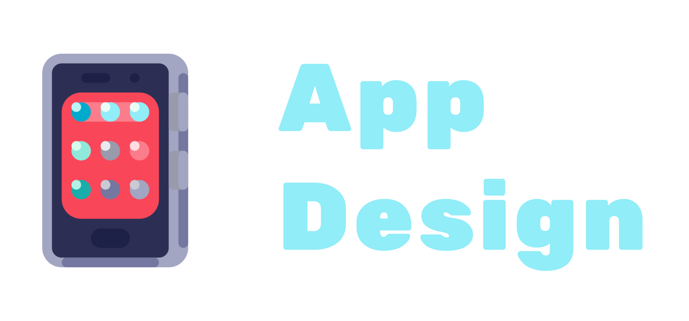
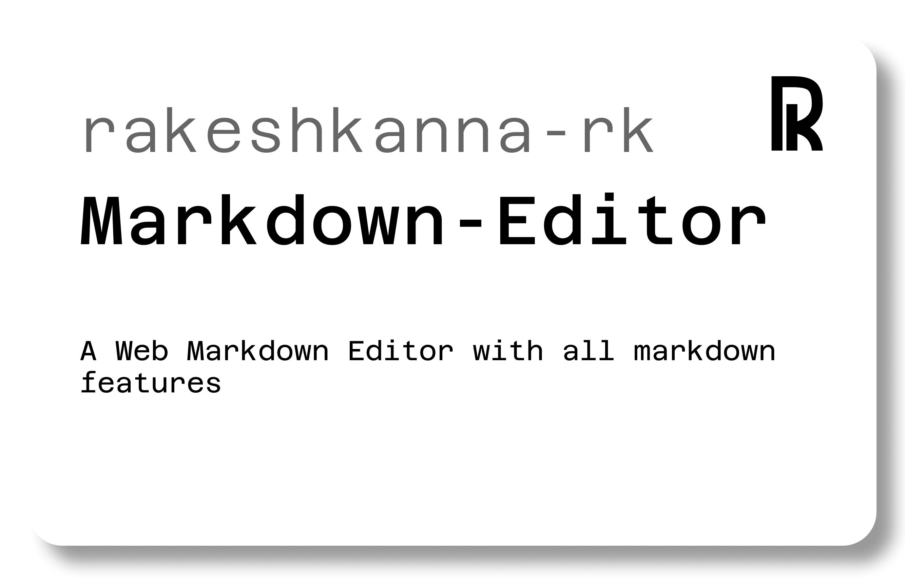

  

  &nbsp;&nbsp;
  &nbsp;&nbsp;
  &nbsp;&nbsp;
  &nbsp;&nbsp;
  
  

&nbsp;
&nbsp;
&nbsp;

# About Me

#### As a passionate learner and aspiring developer, I am dedicated to exploring the vast world of technology. My journey in software development focuses on web development and Python programming, where I strive to create innovative and efficient solutions. While development is my primary focus, I also bring a designer's touch to my projects, ensuring they are both functional and visually appealing. Additionally, I enjoy honing my writing skills to effectively communicate ideas and document my learning experiences.

 

## Areas of Interest

**Web Development , Python Programming , Full-Stack Development ,  Open Source Contributions**

 

## Skills

**Development**

  &nbsp;&nbsp;
  &nbsp;&nbsp;
  &nbsp;&nbsp;
  &nbsp;&nbsp;
  &nbsp;&nbsp;
  &nbsp;&nbsp;
  

**Design**

    &nbsp;&nbsp;
    &nbsp;&nbsp;
    &nbsp;&nbsp;
    &nbsp;&nbsp;
   &nbsp;&nbsp; 
    &nbsp;&nbsp;

**Writing**

    &nbsp;&nbsp;
    &nbsp;&nbsp;
    &nbsp;&nbsp;

**Software Familier**

    &nbsp;&nbsp;
    &nbsp;&nbsp;
    &nbsp;&nbsp;

&nbsp;
&nbsp;
&nbsp;

## Recent Projects

    &nbsp;&nbsp;

    &nbsp;&nbsp;

    &nbsp;&nbsp;

  &nbsp;&nbsp;

&nbsp;&nbsp;

&nbsp;&nbsp;

---

## I'm a young developer, designer, writer

  

<!---
rakeshkanna-rk/rakeshkanna-rk is a ✨ special ✨ repository because its `README.md` (this file) appears on your GitHub profile.
You can click the Preview link to take a look at your changes.
--->
